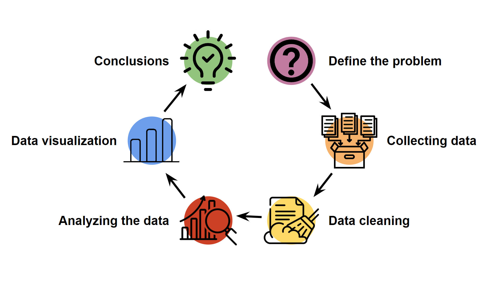

# Intro to Data Science

This repository is dedicated to the "Intro to Data Science" section of the GHOST science club. The section is designed to introduce participants to key concepts and methodologies related to data analysis and data science.

<svg width="100%" height="50px">
    <text x="50%" y="50%" text-anchor="middle" fill="white" font-size="25px">
        Data Analysis Process
    </text>
</svg>

**Scope**

The section focuses on the Data Analysis Process, covering the following topics:

- **Linear Algebra**: Fundamental mathematical operations used in data analysis, such as matrices, vectors, and transformations.
- **Statistics**: Statistical concepts that aid in understanding and interpreting data.
- **Data Cleaning**: The process of cleaning data, identifying and correcting errors in datasets.
- **Data Visualization**: Tools and techniques for presenting analysis results in graphical form.
- **Exploratory Data Analysis (EDA)**: A process of exploring data to discover patterns, relationships, and trends.

**Repository Contents**

This repository contains educational resources that support participants in gaining practical skills in data science:

- **Presentations**: Slides used during the meetings, covering the theoretical foundations of the discussed topics.
- **Datasets**: Data used during the meetings for analysis and hands-on tasks.
- **Notebooks**: Interactive notebooks with Python code that allow participants to work independently and experiment with data analysis.
